

  <a href="#">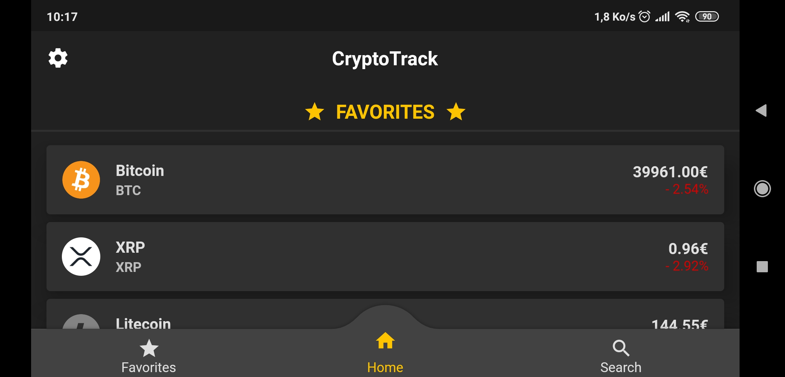</a>

  <h1 align="center"> CryptoTrack </h1>

  

     
    <a href="#about-the-project">About the project</a>
    ·
    <a href="#built-with">Built With</a>
    ·
    <a href="#main-features">Main Features</a>
    ·
    <!--<a href="#getting-started">Getting Started</a>
    .-->
    <a href="#gallery">Gallery</a>
    .
    <a href="#contact">Contact</a>
     
     
    
  
  
  

 

<!-- ABOUT THE PROJECT -->
## About the project

CryptoTrack is a cryptocurrency tracking application.
The purpose of this personal project is to learn how to develop a mobile application with a cross-platform framework.

<!-- BUILT WITH -->
## Built With

* [Flutter](https://flutter.dev/)
* [Dart](https://dart.dev/)

<!-- MAIN FEATURES -->
## Main Features

   | 
 Tâches 
                                                                      | Status                    |
   | :---                                                                                                          |           :---:           |
   | Fetch data from API                                                                                           |     :white_check_mark:    |
   | [Managing application state](https://flutter.dev/docs/development/data-and-backend/state-mgmt/simple)         |     :white_check_mark:    |
   | Navigation                                                                                                    |     :white_check_mark:    |
   | '_Pull to refresh_'                                                                                           |     :white_check_mark:    |
   | Automatic fetch data update                                                                                   |     :white_check_mark:    |
   | [Persisting favorites](http://flutterdevs.com/blog/using-sharedpreferences-in-flutter/)                       |     :white_check_mark:    |
   | Reorder favorites (Drag List)                                                                                 |     :white_check_mark:    |
   | Cryptocurrency details page                                                                                   |     :white_check_mark:    |
   | Cryptocurrency widget converter                                                                               |     :white_check_mark:    |
   | Cryptocurrency search                                                                                         |     :white_check_mark:    |
   | Cryptocurrencies sorting                                                                                      |     :white_check_mark:    |

<!-- GETTING STARTED -->
<!--## Getting Started-->

## Gallery

  
 Show gallery 

   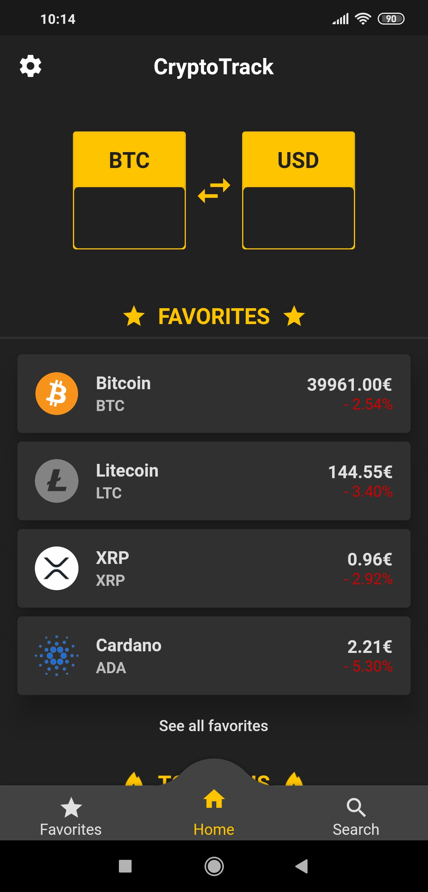  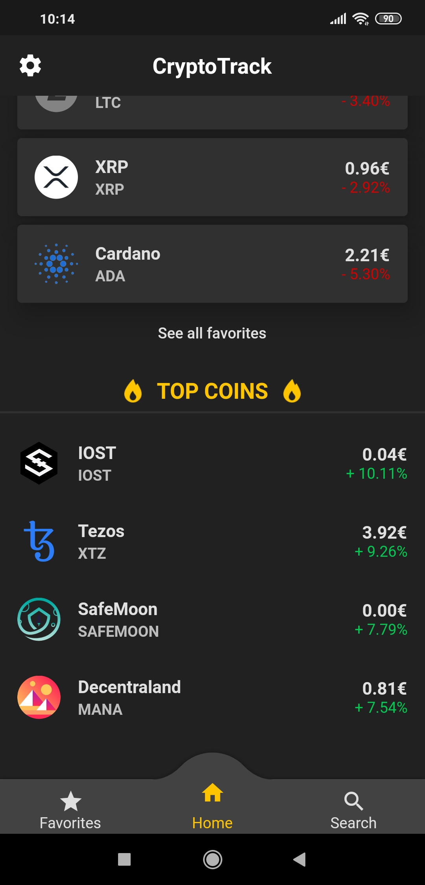  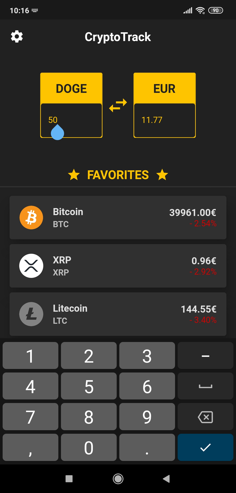  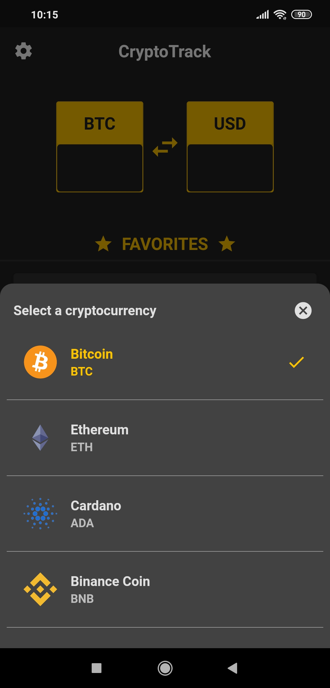 
   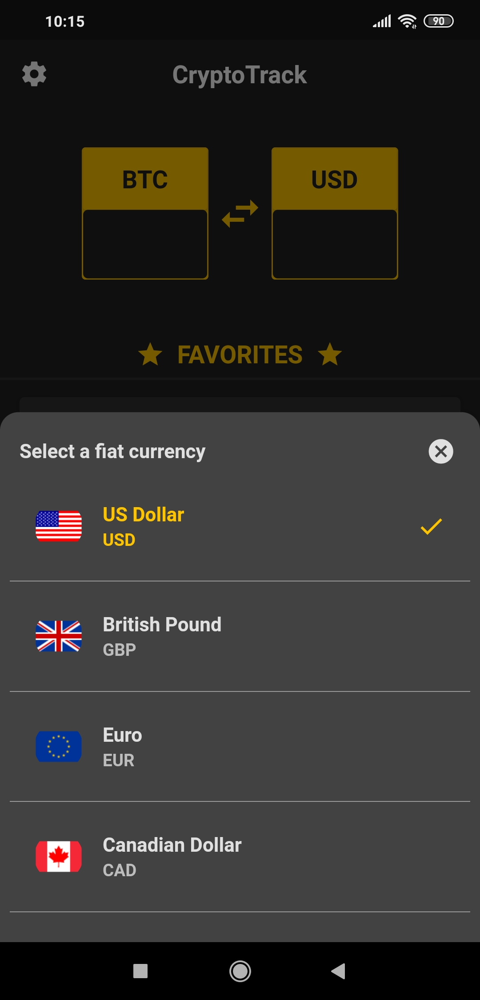  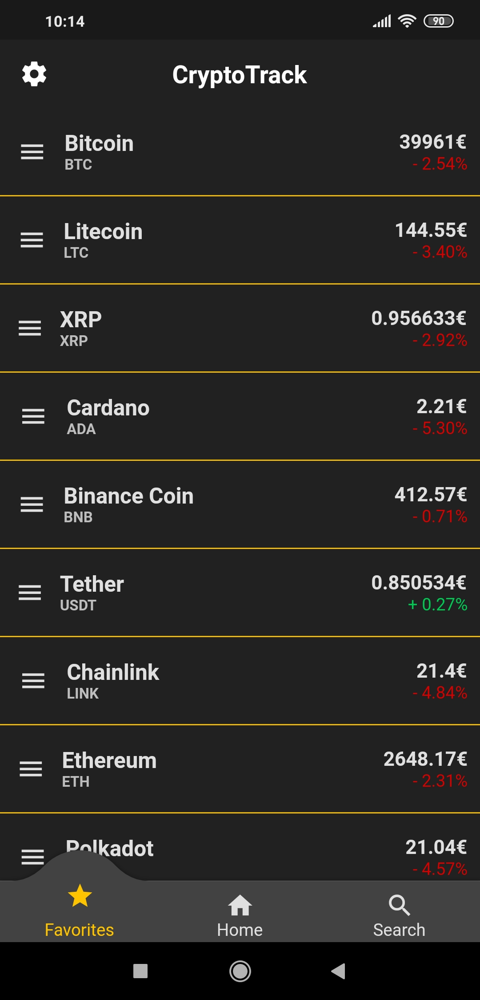 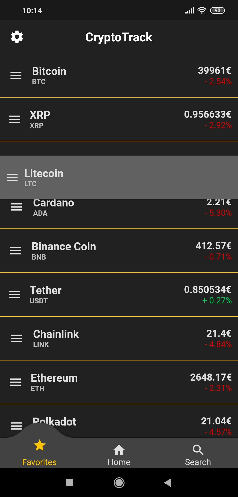  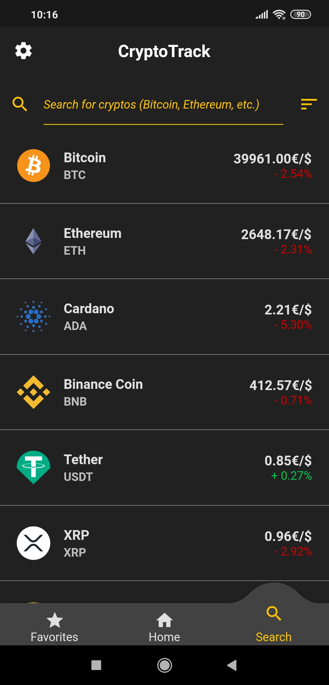 
   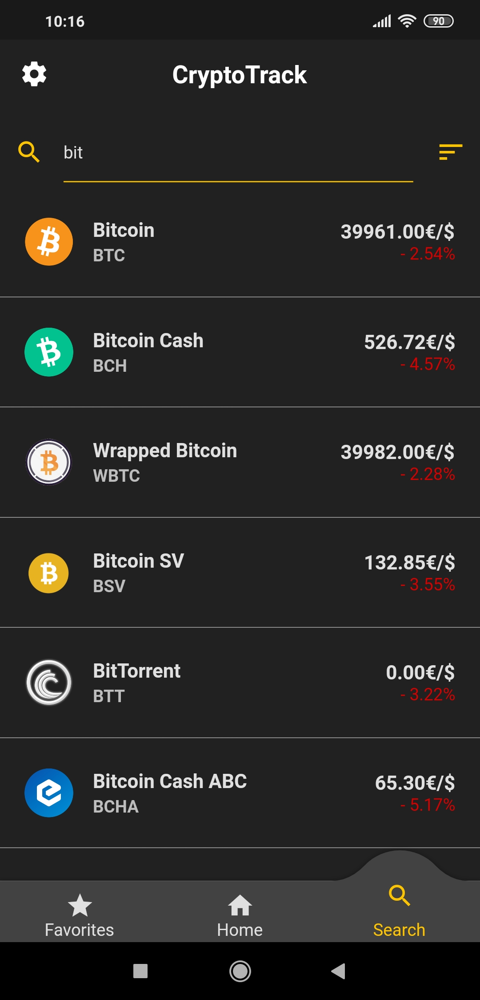  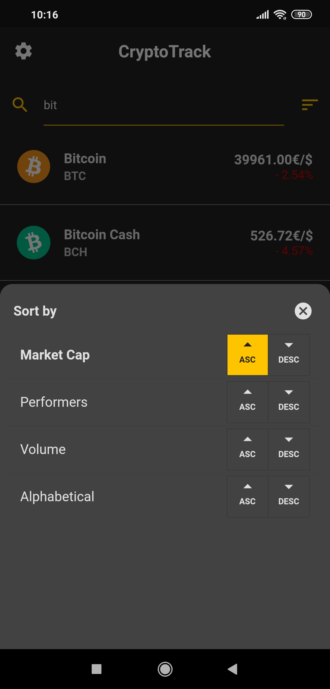  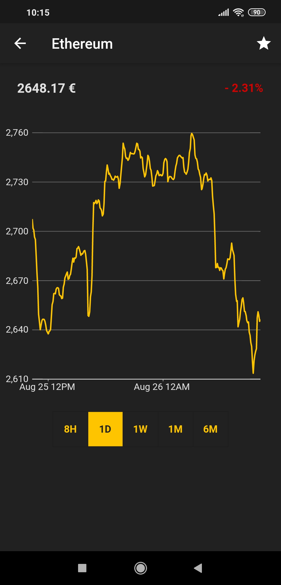 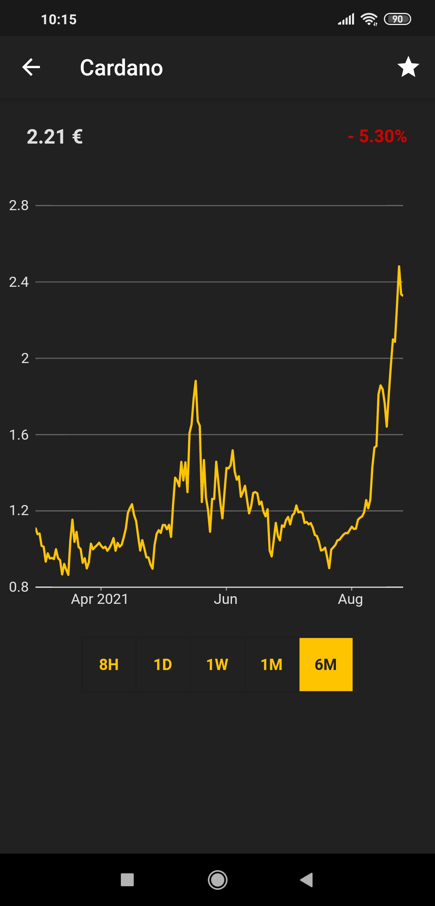 
  
  

<!-- CONTACT -->
## Contact

  
  
  

##

  

